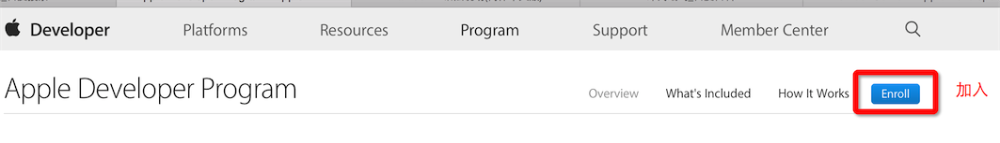
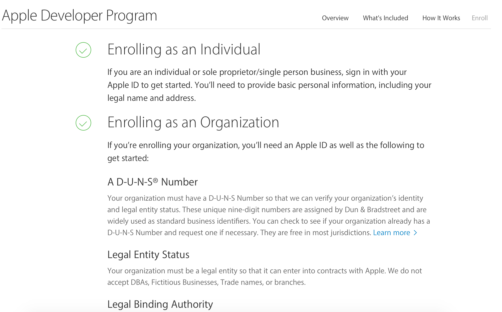
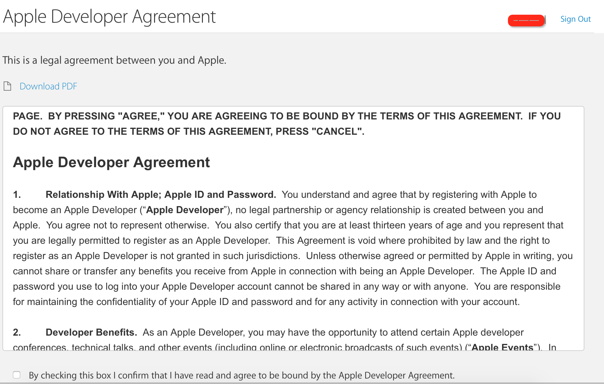
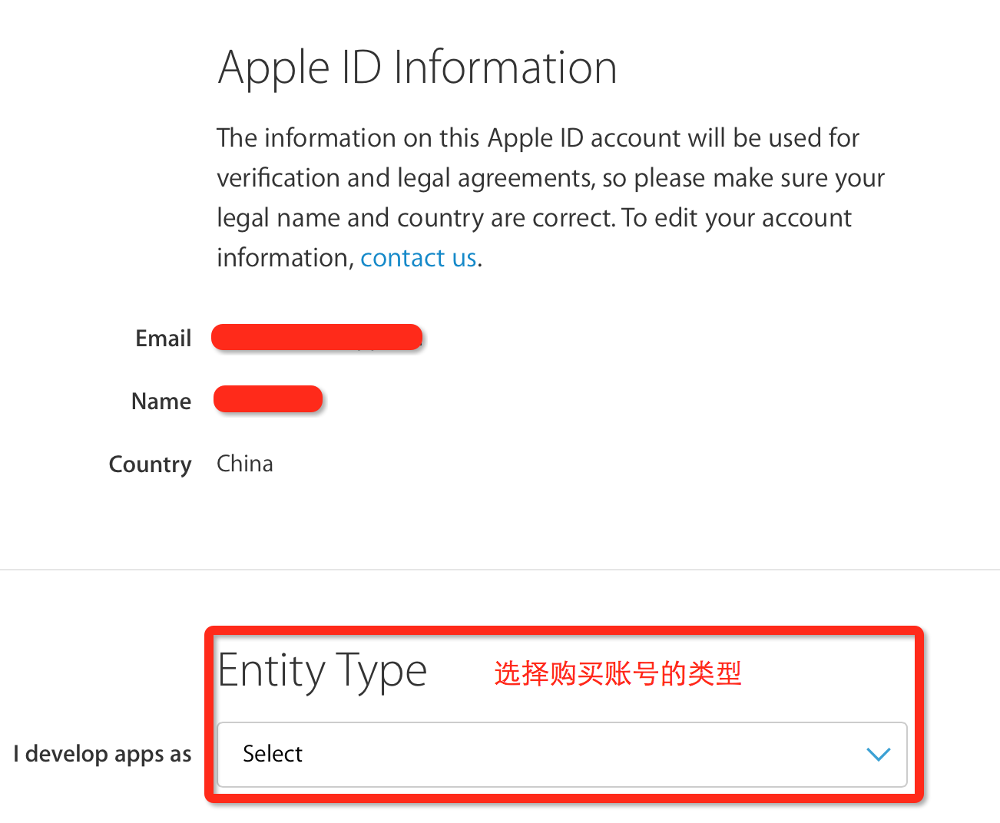
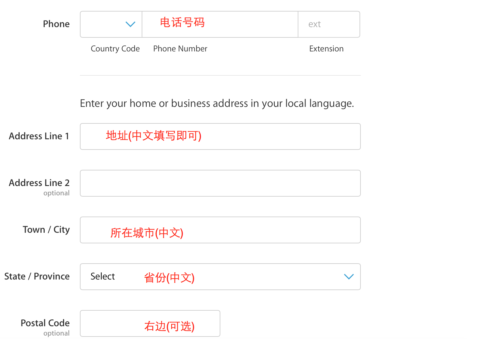
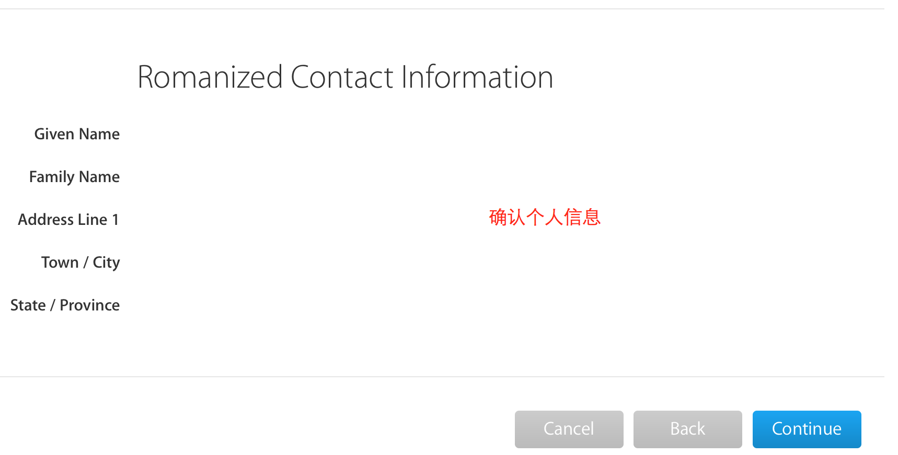
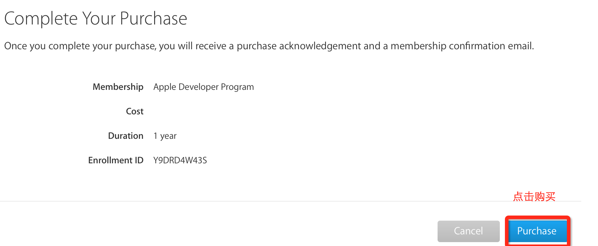
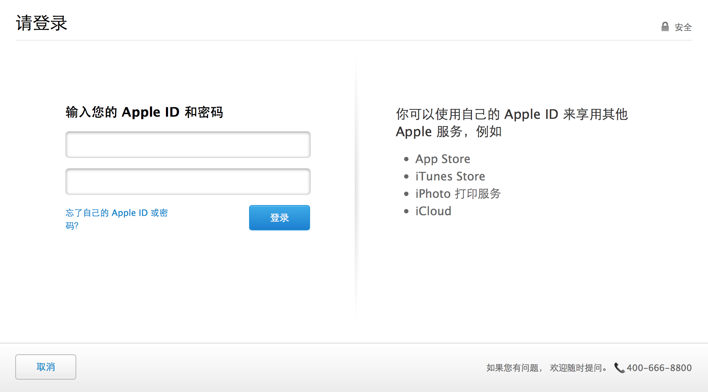
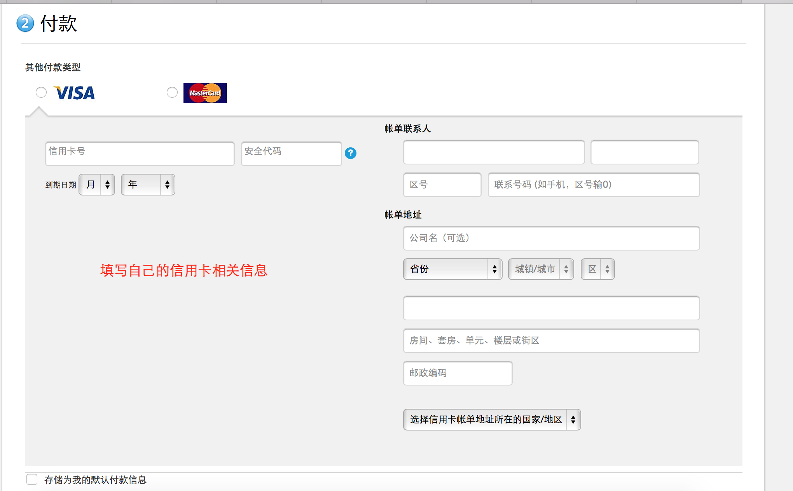

## 加入苹果开发者计划
### 一.加入苹果开发者计划的用处
* 无缝真机调试
    * 如果没有加入,必须Xcode7以上才可以真机调试
    * 会报错,需要修复错误.
* 打包测试程序
* 发布自己(或者公司的)App到AppStore上让用户下载使用

### 二.开发者账号的分类
* 为什么要分类
    * 就像QQ的各种钻一样,不同的钻有不同的作用
    * 不同的开发者账号,也有不同的作用
* 账号的分类
    * 个人账号($99)==688
        * 功能:可以真机调试, 打包测试, 程序发布
        * 优点:申请速度快, 给钱就行, 1-3个工作日即可
        * 缺点:不能进行团队管理
    * 公司账号($99)==688
        * 功能:可以真机调试, 打包测试, 程序发布
        * 优点:可以进行团队管理
        * 缺点:
            * 申请复杂:需要`邓白氏`认证
            * 申请周期较大(邓白氏和企业认证过程都较长)
    * 企业账号($299)
        * 功能:真机调试,打包测试
        * 优点:
            * 可以在企业内部随意安装到苹果设备,不需要经过AppStore审核
            * 可以进行团队管理
            * 可以快速迭代版本
        * 缺点:
            * 申请复杂,需要`邓白氏`认证
            * 申请周期较大(邓白氏和企业认证过程都较长)
            * 不能将App发布到AppStore中
        * 常见使用场景:企业内部使用的办公软件

### 三.邓白氏介绍
 * 什么是邓白氏?(`企业的身份标示`)
 
 * 如何申请邓白氏认证
    * 错误做法:尽量不要从网络渠道以及代申请的公司去申请”邓白氏编码”, 一个花钱多, 而且申请下来的”邓白氏编码”不一定和苹果服务器数据库内一致,最终不可用,导致浪费时间和金钱
    * 正确做法:直接和苹果客服MM(不一定是MM,可能是GG)联系, 她们会告诉你申请流程, 需要提交哪些材料
    * 客服电话:400 670 1855

### 四.加入开发者计划步骤
* 1.[进入开发者主页](https://developer.apple.com)
* 2.加入开发者计划
* 3.下一个页面中,选中加入
* 4.关于账号类别的介绍
* 5.同意苹果的相关协议
* 6.选择购买账号的类型
* 7.填写个人信息
* 8.确认个人信息
* 9.点击购买
* 10.再次登录确认信息
* 11.填写自己的信用卡相关信息
* 12.点击继续后,会直接扣除钱.在1-3个工作日会邮件通知购买成功
